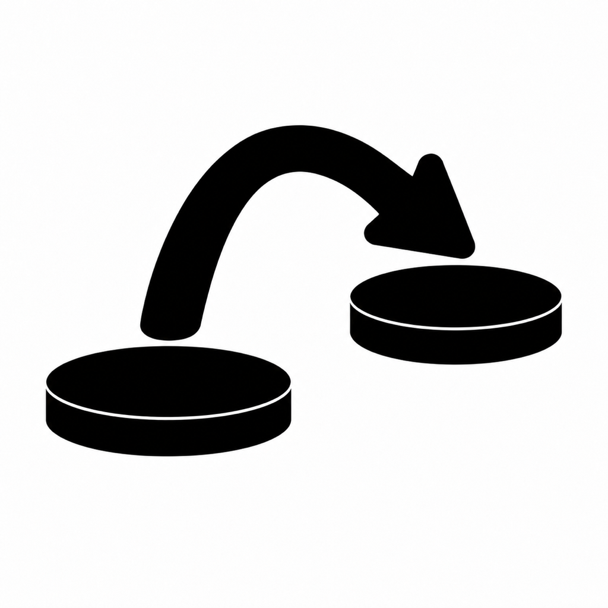
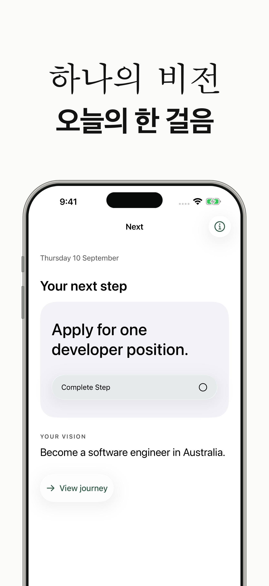
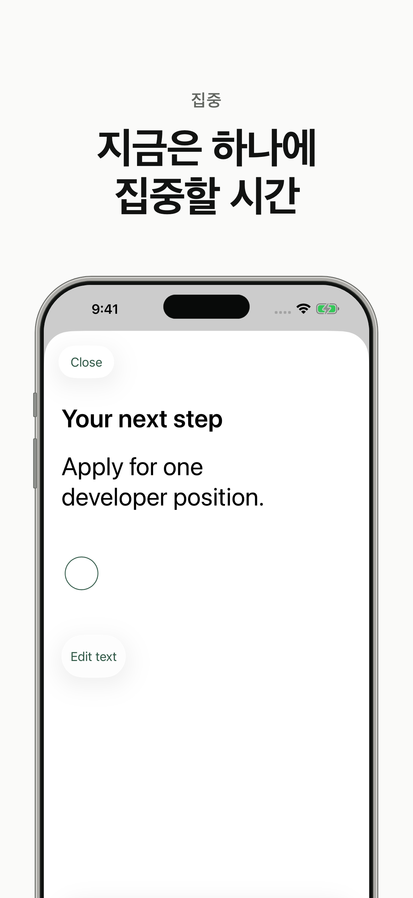
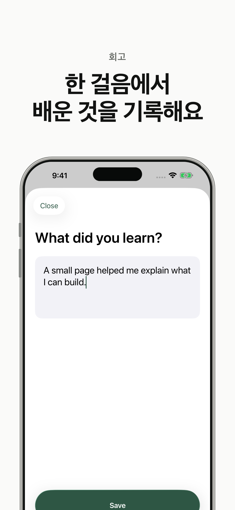
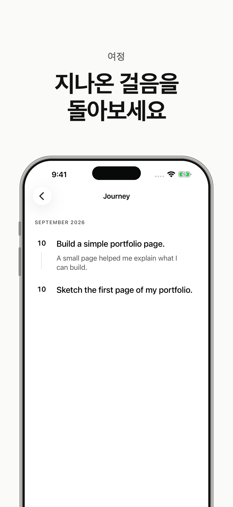

  <a href="README.md">English</a> · <strong>한국어</strong>

  

<h1 align="center">Next</h1>

  <strong>하나의 비전. 지금 할 수 있는 한 걸음.</strong> 
  One vision. One next step. Keep moving.

원하는 미래가 있다면, 그쪽으로 움직일 작은 행동 하나부터 시작해 보세요.

**Next는 나아가고 싶은 방향을 적고, 다음 행동 하나에 집중하고, 걸어온 과정을 돌아보는 iPhone 앱입니다.** 큰 목표와 오늘의 실천을 연결해, 자신의 속도로 다음 걸음을 이어가도록 돕습니다.

| 방향을 기억하세요 | 지금은 하나에 집중하세요 | 배운 것을 남겨보세요 | 걸어온 길을 돌아보세요 |
| :---: | :---: | :---: | :---: |
|  |  |  |  |

실제 앱 화면을 바탕으로 만든 소개 이미지입니다. 현재 앱 인터페이스는 영어로 제공됩니다.

## 왜 Next를 만들었나요?

되고 싶은 모습이나 이루고 싶은 일이 있어도, 막상 오늘 무엇을 해야 할지 선명하지 않을 때가 있습니다. 목표가 클수록 시작은 멀게 느껴지고, 계획을 정리하다 정작 행동할 힘을 쓰기도 합니다. 바쁘게 하루를 보냈는데 내가 원하는 방향으로 움직였는지 모르겠는 날도 있습니다.

Next는 그 순간에 꺼낼 수 있는 작은 도구를 만들고 싶어서 시작했습니다. 원하는 미래를 한 문장으로 곁에 두고, 그 미래에 조금 가까워지는 행동 하나를 고를 수 있도록요.

그래서 앱의 중심에는 두 가지가 있습니다. **내가 향하는 곳, Vision. 그리고 지금 할 수 있는 일, Next Step.** 앱을 열었을 때 이 둘이 함께 보이도록 만들었습니다. 오늘의 작은 행동에도 내가 그것을 선택한 이유가 남아 있기를 바랐습니다.

## 왜 비전도, 지금 할 행동도 하나일까요?

### 비전 하나 — 지금 중요한 방향을 분명하게

Next에서는 한 시점에 하나의 Vision을 적습니다. 이 앱을 통해 꾸준히 이어가고 싶은 방향을 하나 선택하는 것입니다. 선택한 방향이 선명하면, 다음 행동을 정할 때도 ‘이 일이 내가 원하는 곳으로 이어지는가?’라는 기준을 가질 수 있습니다.

원하는 미래를 처음부터 완벽하게 표현할 필요는 없습니다. 생각이 구체화되거나 방향을 다듬고 싶어지면 Vision의 문장을 수정할 수 있습니다. 그동안의 걸음과 회고는 그대로 이어집니다.

### 행동 하나 — 앱을 열 때마다 다시 고르지 않도록

하고 싶은 일을 많이 적어두면, 앱을 열 때마다 어디서 시작할지 다시 결정하게 되기도 합니다. Next에서는 그 선택을 먼저 한 번 하고, 홈 화면에서 **지금 해보기로 한 행동 하나**를 만나도록 했습니다.

‘서비스를 완성하기’가 너무 크게 느껴진다면 ‘첫 화면을 종이에 그리기’로 바꿔보세요. 완료 전에는 행동의 문장을 수정할 수 있습니다. 지금 손댈 수 있고, 끝났는지 알 수 있는 크기로 정하는 것이 이 구조의 핵심입니다.

### 완료한 뒤 다음 행동 — 해본 경험으로 다음을 정하도록

Next에서는 현재 Step을 완료해야 새 Step을 적을 수 있습니다. 하나를 선택하고, 실제로 해보고, 그 결과를 바탕으로 다음을 정하는 흐름을 지키고 싶었기 때문입니다.

시작하기 전에 예상했던 다음 일은 직접 해본 뒤 달라질 수 있습니다. 첫 화면을 그려보니 기능 구현보다 사용자의 의견을 먼저 듣고 싶어질 수도 있습니다. Next는 그 배움을 다음 선택에 반영할 자리를 남깁니다. 완료 후의 회고는 선택 사항이므로, 생각을 기록하거나 곧바로 다음 행동을 정할 수 있습니다.

이렇게 **선택 → 실행 → 완료 → 다음 선택**을 한 번씩 이어갑니다. 완료한 행동은 Journey에 쌓이고, 홈에는 새로 선택한 한 걸음이 놓입니다. 하나를 끝내본 경험이 다음 한 걸음을 시작하는 힘이 되었으면 합니다.

## 이 앱을 통해 만들고 싶은 변화

Next를 통해 마음속에 있던 방향이 실제로 해본 일로 이어졌으면 합니다. ‘언젠가 해보고 싶다’고 적었던 일이 첫 시도가 되고, 그 시도에서 배운 것이 다음 선택으로 연결되기를 바랍니다.

완료한 행동과 선택적으로 남긴 회고는 **Journey**에 쌓입니다. 변화가 잘 느껴지지 않는 날, 그 기록을 열고 ‘여기까지는 내가 해왔구나’ 하고 확인할 수 있었으면 좋겠습니다. Next가 돕고 싶은 것은 그렇게 자신의 움직임을 알아보고, 다음 행동을 스스로 선택하는 일입니다.

## 이런 순간에 함께하고 싶습니다

| 이런 사람에게 | 이런 도움이 되었으면 합니다 | 시작해 볼 한 걸음 |
| --- | --- | --- |
| 취업이나 새로운 진로를 준비하며 출발점이 막막한 사람 | 원하는 모습을 구체적인 준비 행동으로 옮기기 | 관심 있는 채용 공고 하나를 읽고 필요한 역량 적기 |
| 글, 서비스, 개인 프로젝트처럼 만들고 싶은 것이 있는 사람 | 머릿속 아이디어를 눈에 보이는 첫 결과로 꺼내기 | 만들고 싶은 서비스의 첫 화면을 종이에 그리기 |
| 여러 일을 하느라 자신에게 중요한 일을 미뤄온 사람 | 내가 선택한 방향을 다시 떠올리고 행동할 자리 만들기 | 오래 미뤄둔 글의 첫 문단 쓰기 |
| 잠시 멈췄다가 다시 시작하려는 사람 | 이전의 시도를 돌아보고 지금 가능한 일부터 이어가기 | 지난 기록을 읽고 현재 Step을 지금 할 수 있는 크기로 다듬기 |

‘지금 할 수 있는 크기’는 사람마다 다릅니다. Next에는 연속 달성 기록이나 생산성 점수가 없습니다. 며칠 쉬었다 돌아와도, 남아 있는 방향과 기록을 보고 자신의 걸음을 이어가면 됩니다.

## 이렇게 한 걸음씩 사용해 보세요

1. **Vision을 적습니다.** 나아가고 싶은 미래를 자신의 말로 남깁니다. 예를 들어 ‘내가 만든 서비스를 사람들에게 선보이고 싶다’처럼요.
2. **Next Step 하나를 고릅니다.** ‘첫 화면을 종이에 그리기’처럼 시작과 끝이 보이는 행동을 적습니다. 홈 화면에서 그 행동과 Vision을 함께 확인할 수 있습니다.
3. **실제로 해보고, 완료합니다.** 해낸 걸음을 기록하고 원한다면 배운 점을 짧게 남깁니다. 회고는 건너뛰어도 괜찮습니다.
4. **다음 걸음을 선택합니다.** ‘스케치를 한 사람에게 보여주고 의견 듣기’처럼 방금의 경험을 다음 행동으로 이어갑니다. 지난 걸음은 Journey에서 돌아볼 수 있습니다.

처음부터 모든 순서를 정할 필요는 없습니다. 해본 뒤에 알게 된 것을 바탕으로, 다음 한 걸음을 정해보세요.

## 개인적인 기록을 편안하게

Vision과 Step, Reflection은 기기에 저장됩니다. 계정 가입 없이 시작할 수 있고, 핵심 기능은 오프라인에서 사용할 수 있습니다. 광고나 분석 SDK를 넣지 않았습니다.

앱 자체의 클라우드 동기화는 제공하지 않으며, 기록은 기기 백업에 포함될 수 있습니다. iOS 17 이상의 iPhone에서 사용할 수 있고, 밝은 모드·어두운 모드와 시스템 글자 크기를 지원합니다.

[개인정보처리방침](https://www.visionexperiencedeveloper.com/ko/policies/next) · [지원 및 FAQ](https://www.visionexperiencedeveloper.com/ko/supports/next)

---

**지금, 당신이 향하고 싶은 곳은 어디인가요?** 
그 방향으로 움직일 수 있는 작은 행동 하나를 골라보세요.

Made by [VXDeveloper](https://www.visionexperiencedeveloper.com)

개발 및 프로젝트 문서

SwiftUI와 SwiftData로 만든 네이티브 iPhone 앱입니다. 외부 SDK나 패키지 의존성 없이 동작합니다.

`Next.xcodeproj`를 열고 `Next` 스킴과 iPhone 시뮬레이터를 선택해 실행할 수 있습니다. 실제 기기에서 실행하거나 배포하려면 자신의 Apple Developer Team을 설정하세요. Bundle ID는 `com.visionexperiencedeveloper.next`입니다.

Xcode 프로젝트가 포함되어 있어 별도 생성 도구 없이 열 수 있습니다. 소스 파일을 추가한 뒤 프로젝트를 재생성하려면 `xcodeproj` gem을 설치하고 `ruby scripts/generate-project.rb`를 실행합니다. 재생성 전에는 개인 서명 설정을 보존하세요.

- [제품과 사용 흐름](docs/Product.md)
- [구조와 데이터 모델](docs/Architecture.md)
- [디자인 시스템](docs/Design.md)
- [검증 기록과 범위](docs/Verification.md)
- [App Store 자료](release/app-store/README.md)
- [빌드·업로드·심사 진행 기록](release/app-store/readiness.md)

저장소에는 앱 소스, 테스트, 프로젝트 설정, 문서와 소개 이미지를 포함합니다. 빌드 결과물, 서명 자격 증명, 로컬 실행 증거, 생성한 ZIP 파일과 별도 웹사이트 작업 폴더는 제외합니다. 검증 문서에 언급된 로컬 로그와 결과 번들은 포함하지 않습니다.

