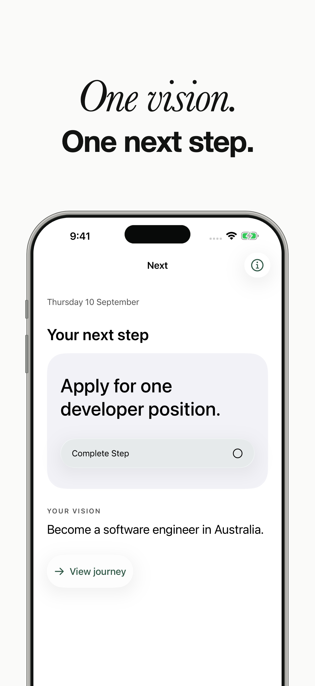
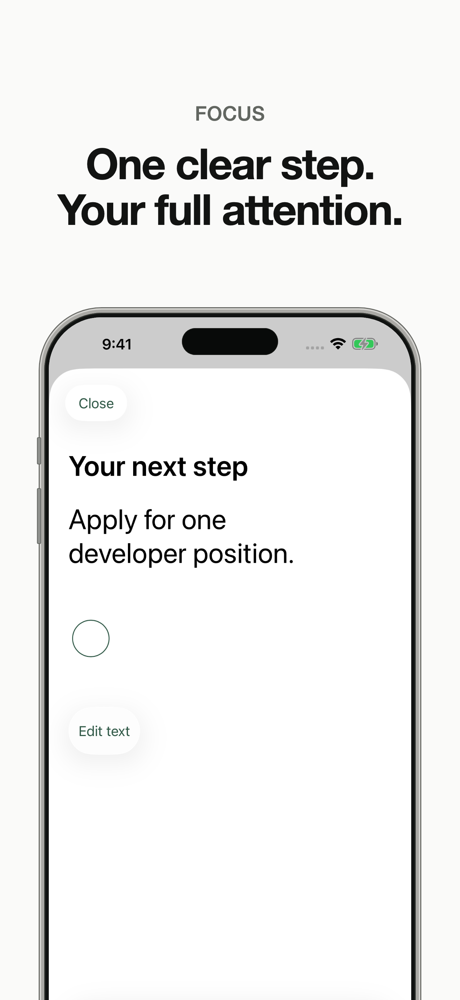
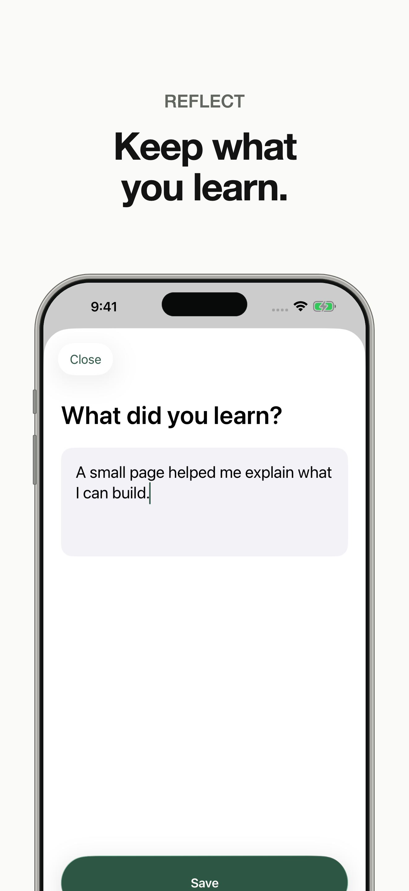
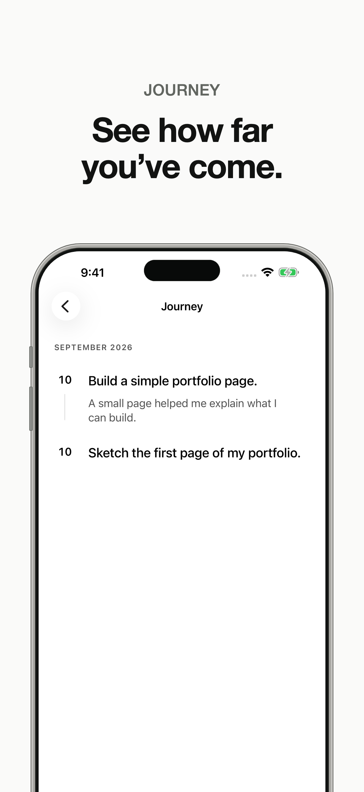

  <strong>English</strong> · <a href="README.ko.md">한국어</a>

  

<h1 align="center">Next</h1>

  <strong>One vision. One step you can take now.</strong> 
  One vision. One next step. Keep moving.

If there is a future you want to move toward, begin with one small action in that direction.

**Next is an iPhone app for keeping your direction in sight, focusing on one next action, and looking back on the steps you have taken.** It connects a bigger goal to something you can do today, helping you keep moving at your own pace.

| Keep your direction in sight | Focus on one step | Keep what you learn | See how far you have come |
| :---: | :---: | :---: | :---: |
|  |  |  |  |

Promotional images based on actual app screens. The app interface is currently available in English.

## Why Next was created

You may know who you want to become or what you want to make, yet still feel unsure about what to do today. A bigger goal can make the starting point feel further away. Planning can take up the energy you hoped to spend on doing. And a busy day can end without a clear sense of whether you moved toward something that matters to you.

Next began with a simple intention: to offer a small tool for those moments. A place to keep the future you want in one sentence, and choose one action that brings it a little closer.

That is why two things sit at the heart of the app: **where you are heading, your Vision; and what you can do now, your Next Step.** They appear together when you open the app, so even a small action stays connected to the reason you chose it.

## Why just one Vision and one current action?

### One Vision to make your direction clear

Next holds one Vision at a time. You choose one direction you want to keep working toward with this app. A clear direction gives you a useful question when choosing your next action: “Does this move me toward the future I want?”

You do not need to describe that future perfectly from the start. As your thinking becomes clearer, you can edit your Vision. Your previous steps and reflections stay with it.

### One action so you can begin without choosing again

A long list of things you want to do can mean deciding where to begin every time you open an app. In Next, you make that choice first. Then the Home screen brings you back to **the one action you have decided to try now**.

If “finish the app” feels too big, try “sketch the first screen on paper.” You can edit an action before completing it. The point is to choose something small enough to start and clear enough to know when it is done.

### Complete a step before choosing the next, so experience can guide you

In Next, you complete your current Step before adding a new one. This keeps a simple rhythm: choose something, try it, and use what happened to decide what comes next.

The next task you imagine before starting may change once you have tried something. After sketching a screen, you might decide to hear from a potential user before building a feature. Next leaves room for that learning to shape your next choice. Reflection is optional after completion, so you can write down a thought or move straight to choosing your next action.

You follow **choose → act → complete → choose again**, one step at a time. Completed actions become part of your Journey, while the Home screen holds your newly chosen step. The hope is that the experience of finishing one thing makes the next thing easier to begin.

## The change Next hopes to help you make

The hope behind Next is that a direction you carry in your mind becomes something you actually try. That “I would like to do this someday” becomes a first attempt, and what you learn from that attempt informs your next choice.

Completed actions and optional reflections collect in your **Journey**. On days when progress is hard to notice, you can open it and see, “This is what I have done so far.” Next is here to help you recognize your own movement and choose your next action for yourself.

## Who it is for, and how it can help

| When this sounds like you | What Next hopes to help with | One step to try |
| --- | --- | --- |
| You are preparing for a job or a new career and do not know where to start | Turn the future you want into a concrete preparation step | Read one job listing that interests you and note the skills it asks for |
| You want to write, build an app, or start a personal project | Bring an idea out of your head and into its first visible form | Sketch the first screen of the app you want to make |
| You have been busy with other things and putting off something important to you | Remember your chosen direction and make room for an action | Write the first paragraph of the piece you have been postponing |
| You are returning after a pause | Look back on earlier attempts and continue with something manageable now | Read your Journey and make your current Step small enough to take |

What feels manageable now is different for everyone. Next has no streaks or productivity scores. After a few days away, your direction and your record are still there, ready for you to continue.

## Take it one step at a time

1. **Write your Vision.** Describe the future you want to move toward in your own words. For example, “I want to share an app I have made with other people.”
2. **Choose one Next Step.** Pick an action with a clear beginning and end, such as “sketch the first screen on paper.” Your Home screen keeps that action and your Vision together.
3. **Try it, then mark it complete.** Record the step you have taken and, if you want, leave a short note about what you learned. It is fine to skip the reflection.
4. **Choose the next step.** Let the experience guide your next action, such as “show the sketch to one person and ask for feedback.” You can revisit earlier steps in your Journey.

You do not need to decide the whole sequence in advance. Try one thing, see what you learn, and choose your next step from there.

## A comfortable place for personal notes

Your Vision, Steps, and Reflections are stored on your device. You can start without creating an account, and the core features work offline. Next includes no ads or analytics SDKs.

The app does not provide its own cloud sync. Your data may be included in device backups. Next is built for iPhone running iOS 17 or later and supports Light Mode, Dark Mode, and system text sizes.

[Privacy Policy](https://www.visionexperiencedeveloper.com/en/policies/next) · [Support and FAQ](https://www.visionexperiencedeveloper.com/en/supports/next)

---

**Where would you like to go?** 
Choose one small action that takes you in that direction.

Made by [VXDeveloper](https://www.visionexperiencedeveloper.com)

Development and project documentation

Next is a native iPhone app built with SwiftUI and SwiftData. It runs without external SDK or package dependencies.

Open `Next.xcodeproj`, select the `Next` scheme and an iPhone simulator, and run. To use a physical device or distribute the app, select your own Apple Developer Team. The bundle ID is `com.visionexperiencedeveloper.next`.

The Xcode project is included, so no project generator is needed to open it. To regenerate the project after adding source files, install the `xcodeproj` gem and run `ruby scripts/generate-project.rb`. Preserve personal signing settings before regenerating.

- [Product and user flows](docs/Product.md)
- [Architecture and data model](docs/Architecture.md)
- [Design system](docs/Design.md)
- [Verification records and scope](docs/Verification.md)
- [App Store materials](release/app-store/README.md)
- [Build, upload, and review progress](release/app-store/readiness.md)

The repository includes app source, tests, project configuration, documentation, and promotional images. Build products, signing credentials, local execution evidence, generated ZIP files, and the separate website checkout are excluded. Local logs and result bundles referenced in verification documents are not included.

